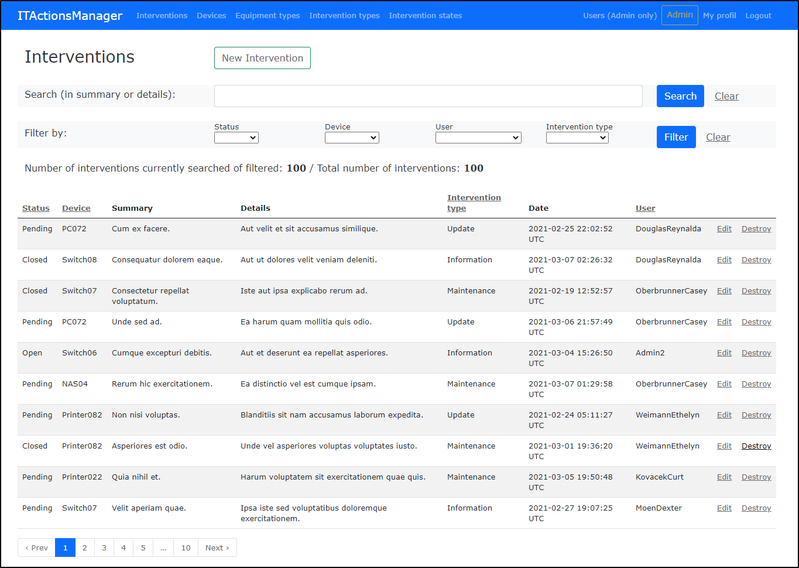
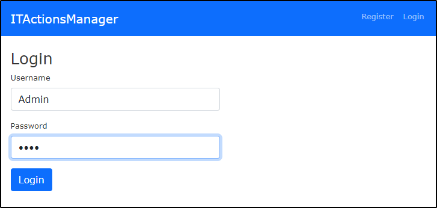
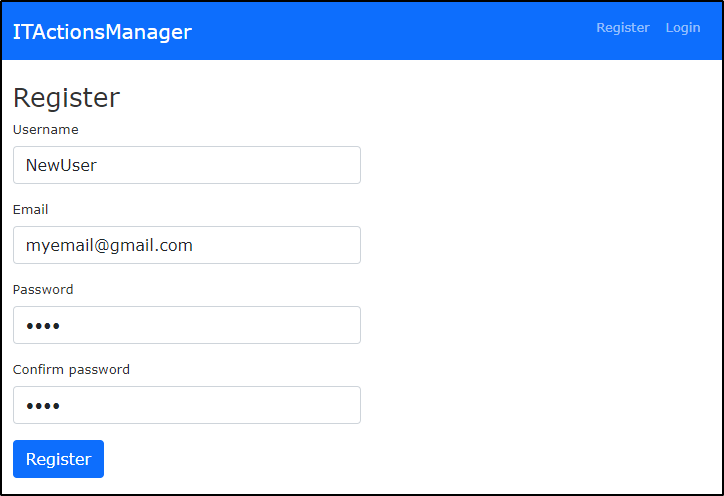
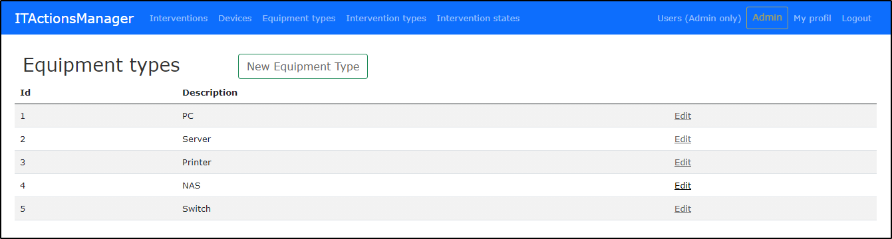
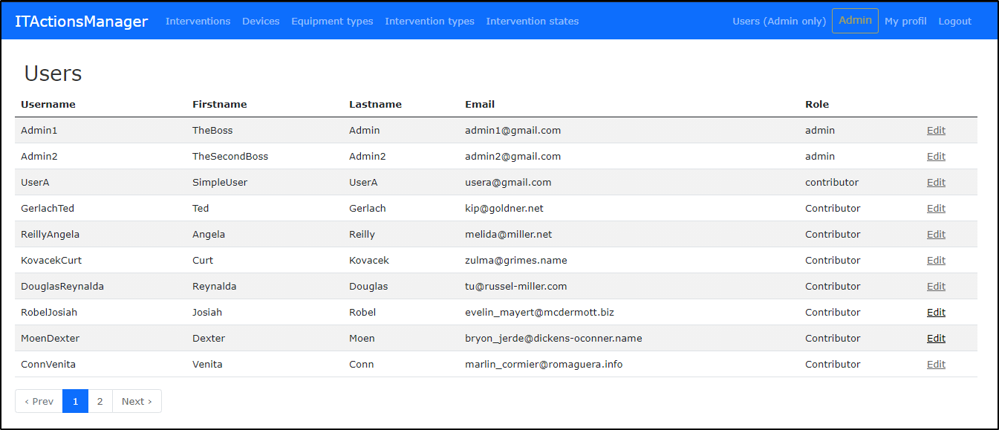
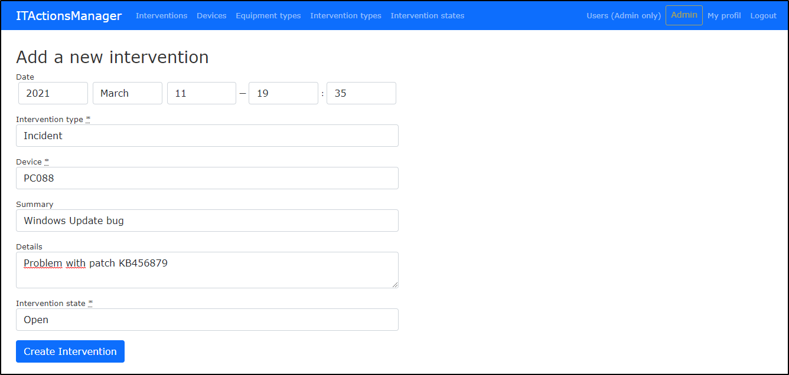
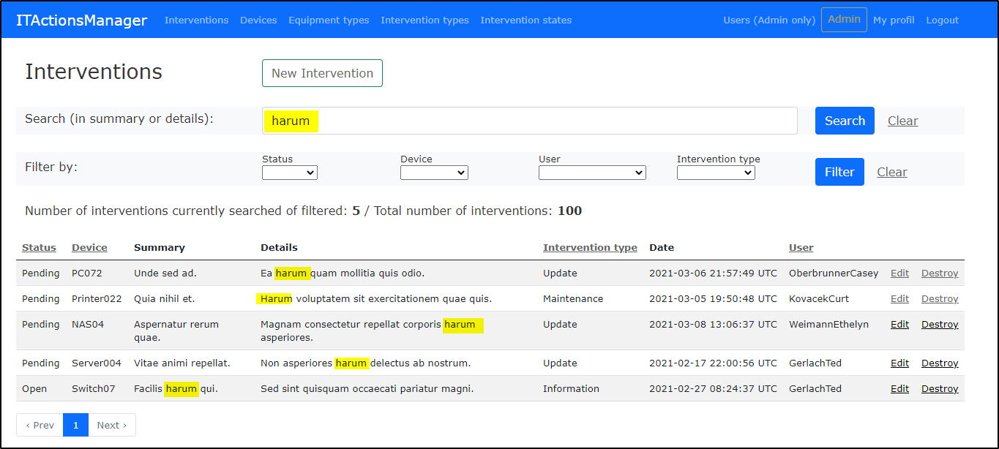
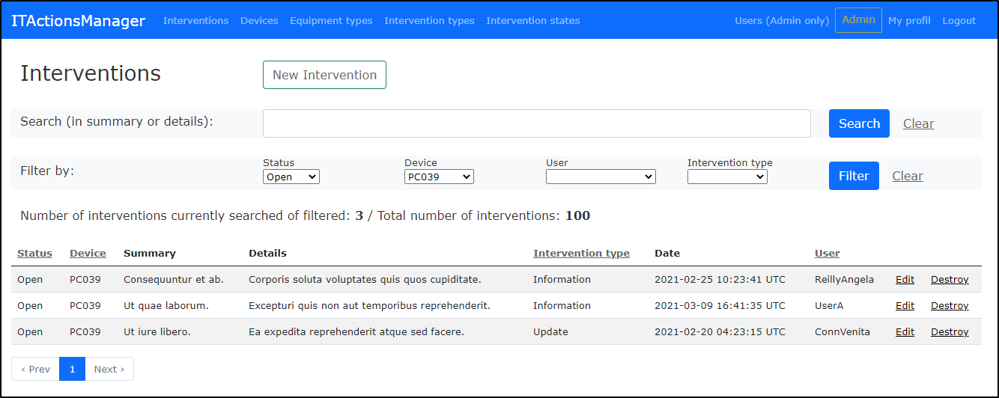

# ITActionsManager-Rails-2021
Application écrite en Ruby on Rails pour gérer les interventions réalisées sur des équipements informatiques.

Ce repository contient les sources du projet "ITActionManager" réalisé dans le cadre du CAS-DAR RoR / 2021.

- [Description de l'application](#description-application)
- [Utilisation de l'application](#utilisation-application)
- [Tester l'application](#tester-application)
- [Choix lors du développement](#choix-developpement)
- [Ressources externes](#ressources-externes)
- [Remarques sur le projet](#remarques-projet)

# Description de l'application
L'application "ITActionsManager" permet à des gérer les actions et interventions réalisées sur des équipements informatiques de plusieurs types. 
C'est en fait un journal des actions de suivi sur les équipements.

# Utilisation de l'application
L'utilisateur doit d'abord se connecter dans l'application avec son nom d'utilisateur et son mot de passe. 

Pour un nouvel utilisteur, il est nécessaire de s'inscrire en fournissant un username et une adresse e-mail aini qu'un mot de passe.
Ce nouvel utilisateur ne possèdera que le rôle de "Contributor".

Le changement de rôle n'est possible que par un administrateur

Deux types d'utilisateur sont possibles (rôle) :
* __Admin__
* __Contributor__ 

L'utilisateur "__Contributor__" ne peut que :
* Editer son profil
* Visualiser la liste des équipements, la liste des types d'intervention et la liste des appareils
* Visualiser, créer et modifier des interventions sur des équipements (modification seulement sur ces propre inteventions).

L'utilisateur "__Admin__" a, en plus, le droit de  :
* Créer/modifier ou effacer des types d'équipements, des types d'interventions et des équipements
* Voir la liste des utilisateurs

Lors de la création d'une nouvelle intervention ou équipement, il faut fournir un certain nombre d'information nécessaires.

Il est possible de rechercher dans les interventions (dans le detail ou dans le summary) grâce à des mots fournis. 

Des filtres sur les différents champs peuvent également être utilisés pour ne voir qu'une partie des interventions.

Dans les deux cas, les résultats sont affichées par page avec des informations sur le nombre total ou trouvé.

La recherche et le filtrage ne peuvent pas être utilisés en même temps. C'est l'un ou l'autre.

Il est également possible de trier par certains colonnes (Status, Device, Intervention_type). 
Ceci va regrouper les interventions (mais pas par ordre alphabétique, par id)

# Test l'application
Pour tester l'application après avoir récupérer les sources, il faut :
* Lancer la commande "rails server"

__Un fichier seed.rb permet de remplir la base avec un certain nombre de resources définies__.
Pour remplir votre base de données avec ses valeurs, il suffit de :
* Lancer la commande "rails db:migrate:reset" pour nettoyer la db actuelle et appliquer les migrations
* Lancer la commande "rails db:seed" pour populer la bd.

Les utilisateurs déjà créés utilisent tous le même mot de passe : __1234__

Voici deux utilisateur possible pour se connecter:
* __Admin1__ (admin)
* __UserA__ (contributor)

# Choix lors développement
Tables et champs nécessaires :
* Pour les users (id, username: string, email:string, password_digest:string, firstname:string, lastname:string, role:string)
* Pour les types d'équipement (id, description:string)
* Pour les devices (id, description:string, type_equipement:reference)
* Pour les types d'intervention (id, description:string)
* Pour les interventions (id, date:datetime, user:id, intervention_type:id, resource:Id, details:text, intervention_state:id)
* Pour les états des interventions (id, description:string)

# Ressources externes
Voici la liste des resources utilisés pour facilite ou simplifier le développement.
* Bootstrap v5.0 (par CDN) 
* Bcrypt : pour l'encryption des mots de passe
* Flash messages : https://www.rubyguides.com/2019/11/rails-flash-messages/
* Simple_Form : https://github.com/heartcombo/simple_form
* Pagy V3.11 : pour la pagination : https://github.com/ddnexus/pagy
* Utilsation de scope pour filtrer les résultats selon http://filterrific.clearcove.ca/pages/active_record_scope_patterns.html
* Faker : pour introduire des valeurs factices : https://github.com/faker-ruby/faker

# Remarques sur le projet
* Les fonctionnalités du frameworok Ruby on rails sont très intéressantes et les scaffold pemettent de développer rapidement une application CRUD avec déjà beaucoup de 

vues disponibles. 
* Durant le développement et les recherches faites, souvent plusieurs solutions existent pour atteindre le but recherché. L'expérience permet certainement de mieux savoir quelle solution 
mettre en place par rapport au performance, eé l'évolution ou autre facteurs.

Il y a aussi un nombre impressionant de GEM a disposition pour faciliter l'utilisation des form, filtres, etc.
Difficile de savoir lequel utiliser sans avoir un peu joué avec et testé les fonctionnalités.

* Le mise en place de test "System" n'a pas fonctionné sur Gitpod. Quelques tests au niveau du modèle ont par contre été mis en place automatiquement par l'utilisation du scaffold,
mais aussi après coup manuellement pour tester quelques possibilités de base.

* L'utilisation de partial doit aussi être bien réfléchi pour éviter de répéter les mêmes bout de code, notament pour les vues "edit" et "new".

* Finalement, et comme pour les autres projets de développement web, l'utilisation de Bootstrap ou autre permet d'améliorer le rendu d'une application, 
même si cela est presque déjà un projet en lui-même (User expérience)

# Améliorations possibles
Certainement beaucoup, mais notamment :
* Validation approfondie des champs saisis 
* Utilisation d'un objet "session" pour la gestion d'un utilisateur connecté
* L'utilisation des partials pour diminuer la duplication de code dans les vues pour les New ou Edit
* Améliorations des filtres et trie sur les colonnes (alphabétique)
* Activation de la suppression d'un User ou Intervention type, mais gestion des dépendances lors d'effacement par modificaton des foreign key en "On Delete Cascade" (et pas en On Delete Restrict par défaut)
* Utilisation d'un model pour le rôle et pas uniquement une string dans le modèle user.
* Responsive design
* ...